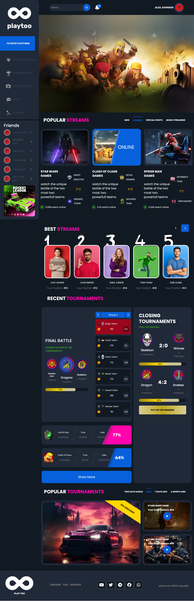
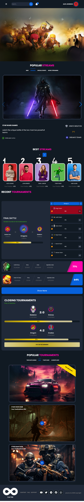
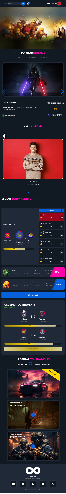
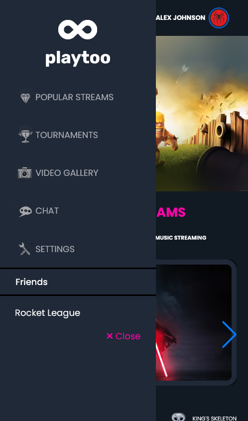

# playtooGameHome

## Overview

This project is a clean rebuild of a gaming website homepage, created to practice front‑end UI implementation and modern layout techniques.  
The layout is built with Bootstrap, and full responsiveness is achieved using Sass Mixins. Interactive elements are implemented with Swiper.js and jQuery.

## Features

- Precise homepage recreation
- Fully responsive design with Sass Mixins
- Bootstrap-based grid and components
- Smooth sliders powered by Swiper.js
- UI interactions using jQuery

## Tech Stack

- HTML5
- CSS3
- Bootstrap
- Sass (Mixins)
- JavaScript
- Swiper.js
- jQuery

## Getting Started

1. Clone the repository:
   git clone https://github.com/maryamyousefzade/playtooGameHome.git

2. Open the main file:
   Open `public/index.html` in your browser.

## Preview

## Project Structure

- `public/` — main site files
- `sass/` — Sass source files and Mixins
- `js/` — scripts and libraries

## Author

Maryam Yousefzade  
GitHub: https://github.com/maryamyousefzade
